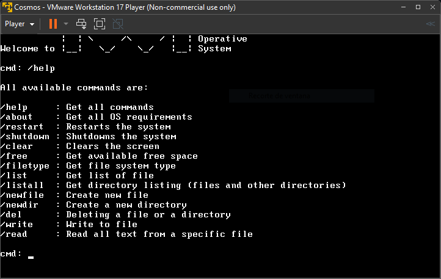

**Welcome to UWU operative system 😀**

## Latest update! MATHS 🧮

The latest update introduces a basic command-line calculator that allows users to 
perform simple arithmetic operations directly in the terminal. 
The calculator supports basic operations such as:

 - Addition (+)
 - Subtraction (-)
 - Multiplication (*)
 - Division (/)

Example:

`cmd: 2+2`

`cmd: 4`

## About UWU_SO 🤓

UWU_SO is a custom operating system built on the Cosmos framework, designed to run directly on hardware or in a virtual machine. 
This project includes basic OS functionalities such as file management, system operations, and a new command-line calculator feature.
This system requires VMware, Cosmos and Visual Studio.
Project made by Quim Baucells. Student from Educem.

## Commands 📋

`/help`     : Get all commands

`/restart`  : Restarts the system

`/shutdown` : Shutdowns the system

`/clear`    : Clears the screen

`/free`     : Get available free space

`/filetype` : Get file system type

`/list`     : Get list of file

`/listall`  : Get directory listing (files and other directories)

`/newfile`  : Create new file

`/newdir`   : Create a new directory

`/del`      : Deleting a file or a directory

`/write`    : Write to file

`/read`     : Read all text from a specific file

## Images 📷

